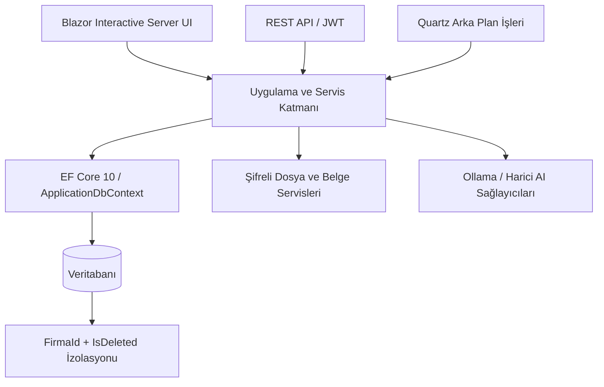

# MKFiloServis

**MKFiloServis**, filo ve servis operasyonlarını, finansal süreçleri ve kurumsal yönetim araçlarını tek bir çok firmalı ERP platformunda bir araya getiren .NET tabanlı bir çözümdür. Ana uygulama Blazor ile geliştirilmiştir; çözüm ayrıca ortak domain bileşenlerini, lisans yönetim aracını ve veri eşitleme uygulamasını içerir.

[](https://dotnet.microsoft.com/)
[](https://learn.microsoft.com/aspnet/core/blazor/)
[](https://www.postgresql.org/)
[]()

---

## İçindekiler

- [Öne çıkan yetenekler](#öne-çıkan-yetenekler)
- [Teknik mimari](#teknik-mimari)
- [Depo yapısı](#depo-yapısı)
- [Geliştirme ortamını hazırlama](#geliştirme-ortamını-hazırlama)
- [Yapılandırma](#yapılandırma)
- [Doğrulama ve test](#doğrulama-ve-test)
- [Dağıtım paketleri](#dağıtım-paketleri)
- [Güvenlik ve destek](#güvenlik-ve-destek)

## Öne çıkan yetenekler

Ürün modülleri kullanıcı yetkileri ve etkin firma bağlamı üzerinden çalışır. Kurulumdaki etkin modüller yapılandırmaya ve dağıtım profiline göre farklılık gösterebilir.

| Alan | Kapsam |
|---|---|
| Filo ve araç yönetimi | Araç kayıtları, plaka ve araç evrakları, bakım ve filo süreçleri |
| Rent a Car | Rezervasyon, tarih aralığına göre müsait araç bulma, kiralama listesi ve durum takibi |
| Rent a Car belgeleri | Kiralama kaydından sözleşme taslağı ve teslim/iade tutanağı ön izlemesi; tarayıcıdan yazdırma veya PDF olarak kaydetme |
| Cari ve finans | Cari kartlar, borç/alacak takibi, fatura ve ödeme süreçleri |
| Personel ve operasyon | Personel/şoför, operasyon ve puantaj iş akışları |
| Yönetim ve araçlar | Lisanslama, veri eşitleme, raporlama ve sistem yönetimi araçları |

Rent a Car belge çıktıları uygulamadaki cari, firma ve kiralama kayıtlarından oluşturulan **düzenlenebilir kontrol taslaklarıdır**. Teslim/iade tutanağındaki yakıt, hasar ve aksesuar kontrolleri mevcut kayıt alanlarında saklanmadığından çıktı üzerinde doldurulmaları gerekir. Bu şablonlar tek başına hukuken onaylı, resmî sözleşme veya mevzuat formu yerine geçmez; kullanımdan önce şirket yetkilisi ve hukuk danışmanı tarafından gözden geçirilip onaylanmalıdır. Resmî kullanım için gereken ek sürücü, sürücü belgesi, sigorta/hasar, kilometre-yakıt teyidi ve imza/elektronik onay süreçleri ayrıca tanımlanıp doğrulanmalıdır.

## Mimari

### İşleyiş akış şeması



- **Web uygulaması:** ASP.NET Core Blazor Interactive Server, .NET 10.
- **Ortak katman:** Paylaşılan entity ve sözleşmeler.
- **Veri erişimi:** Entity Framework Core; çözümde SQL Server, PostgreSQL, MySQL ve SQLite sağlayıcı paketleri bulunur. Etkin sağlayıcı ve bağlantı ayarı çalışma zamanı yapılandırmasına bağlıdır.
- **Firma kapsamı:** Firma bağlamı ve kiracı kapsamı servis/veri erişim katmanında uygulanır; davranış dağıtım yapılandırmasına göre doğrulanmalıdır.
- **Belge ve raporlama:** PDF/Excel çıktıları ve tarayıcı yazdırma yardımcıları.
- **Arka plan işleri ve entegrasyonlar:** Çözüm bileşenleri kapsamında Quartz.NET ve yapılandırılabilir servisler.

## Proje Yapısı

```
MKFiloServis-MultiDb/
├── MKFiloServis.Web/              # Blazor web uygulaması ve servisler
│   └── Tests/                     # Rent a Car kontrolleri ve smoke test projeleri
├── MKFiloServis.Shared/           # Paylaşılan domain modelleri ve sözleşmeler
├── MKFiloServis.Infrastructure/   # Altyapı bileşenleri
├── MKFiloServis.Service/          # Servis uygulaması
├── MKFiloServis.DataSync/         # Veri eşitleme aracı
├── MKFiloServis.LisansDesktop/    # Windows lisans yönetim uygulaması
├── docs/                          # Ürün ve teknik dokümantasyon
├── setup/                         # Kurulum paketi betikleri
└── scripts/                       # Geliştirme ve dağıtım yardımcıları
```

## Başlarken

### Gereksinimler

- [.NET 10 SDK](https://dotnet.microsoft.com/download)
- Repodaki hedef framework’ler için ilgili .NET SDK’ları
- Microsoft Visual Studio 2026 veya güncel `dotnet` CLI
- Seçilen veritabanı sağlayıcısına uygun erişilebilir veritabanı

### Geliştirme Ortamı

```powershell
git clone https://github.com/karamur/MKFiloServis-MultiDb.git
cd MKFiloServis-MultiDb

dotnet restore .\MKFiloServis.slnx
dotnet build .\MKFiloServis.slnx
```

Web uygulamasını yerel ortamınızın veritabanı ve gizli ayarları yapılandırıldıktan sonra başlatın:

```powershell
dotnet run --project .\MKFiloServis.Web\MKFiloServis.Web.csproj
```

> Uygulamanın adresi ve bağlantı noktası etkin ASP.NET Core yapılandırmasına bağlıdır; çalıştırma çıktısındaki adresi kullanın. Gerçek ortam sırlarını kaynak koda veya Git’e eklemeyin.

## Yapılandırma

Uygulama ayarları, ortam değişkenleri ve dağıtım profilinin desteklediği yapılandırma dosyaları üzerinden sağlanır. Başlangıç öncesinde ilgili proje ve dağıtım belgelerini inceleyin.

- Veritabanı sağlayıcısını ve bağlantı ayarlarını ortama göre tanımlayın.
- Kimlik doğrulama, lisanslama, e-posta ve entegrasyon sırlarını güvenli yapılandırma deposu veya ortam değişkenleriyle sağlayın.
- Veritabanı şeması ve başlangıç verileri için projenin migration/kurulum yönergelerini izleyin.
- Kullanıcıya gerekli firma ve modül yetkilerini tanımlayın.

## Doğrulama ve test

```powershell
dotnet build .\MKFiloServis.slnx
dotnet run --project .\MKFiloServis.Web\Tests\RentACar\MKFiloServis.RentACarChecks.csproj
```

Diğer test projeleri ve çalıştırma yönergeleri için `MKFiloServis.Web/Tests` içeriğini inceleyin.

## Dağıtım paketleri

Tüm dağıtım paketleri `setup/build.ps1` ile üretilir:

```powershell
cd setup
.\build.ps1 -Version 1.0.30
```

Kurulum paketleri için `setup/README.md` ve `setup/build.ps1` yönergelerini izleyin. Paket türleri, sürüm ve kullanılabilir dağıtım seçenekleri kurulum profiline bağlıdır. Üretim dağıtımından önce veritabanı yedeği, ortam sırları, lisans, ağ erişimi ve geri dönüş planı doğrulanmalıdır.

## Güvenlik ve destek

- Güvenlik bildirimleri için [SECURITY.md](SECURITY.md) dosyasına bakın.
- Yapılandırma dosyalarına gerçek parola, API anahtarı veya kişisel veri eklemeyin.
- Kimlik/vergi numaraları ve sözleşme çıktıları hassas veri içerebilir; erişim ve saklama politikasını dağıtım ortamında uygulayın.
- Hata bildirirken hassas verileri kaldırın; yeniden üretim adımlarını ve ortam bilgilerini ekleyin.

© MK Yazılım. Tüm hakları saklıdır.
